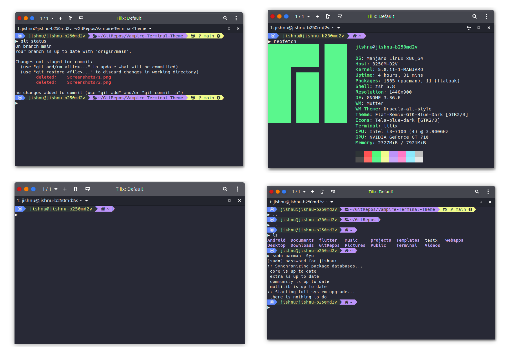

# Vampire 
> Vampire is a color scheme for your terminal inspired from the super popular Dracula Theme . 


## Table of Contents
Here is a quick table to guide you through this repository

- [Supported Terminals](#Supported-Terminals)
- [Installation](#Installation)
- [Screenshots](#Screenshots)
- [Custom ZSH Configuration](#Custom-ZSH-Configuration)
- [License](#license)
- [Author Info](#author-info)

<br>
<br/>

---
## Supported Terminals 
> Currently Vampire Theme is supported by the following terminals . Support for Gnome Terminal, Kitty and Konsole will be added soon!
* Tilix

<br>
<br/>

## Installation
<p>
  
* [Click here](https://github.com/BiswasJishnu/Vampire-Terminal-Theme/releases/download/v0.1/Vampire.json) to download the theme file in your system.
<p/>

### Installation Instructions for Tilix

*  Create a config folder for your terminal (skip if exists)
> This commmand shall create a config folder for your terminal 
```html
    mkdir .config/tilix
```
* Now Create a schemes  folder for your terminal (skip if exists)
> The schemes folder shall contain all the custom theme files for Tilix .This commmand shall create a config folder for your terminal 
```html
    mkdir .config/tilix/schemes
```
* Now Navigate to the destination where you downloaded the theme and copy the theme file
> In the standard case the file should be downloaded in the Downloads folder use 'cd' command to navigate replace Downloads with your path incase files are downloaded in a custom path
```html
   cd ~/Downloads
```
> Copy the theme file to the schemes folder with 'cp' command
```html
   cp vampire.json ~/.config/tilix/schemes
```
* Now reload Tilix and apply the theme

>1. Go to Preferences and select your Tilix profile
>2. Select Colors tab
>3. Select Vampire from dropdown

<br>
<br/>

## Screenshots



## Custom ZSH Configuration

>If you want a terminal setup similar to that of the screenshots follow the instructions

### Install all requirments for customization

* [Click here](https://github.com/BiswasJishnu/Vampire-Terminal-Theme/releases/download/v0.2/Hack.Regular.Nerd.Font.Complete.ttf ) to download the font . This step is   necessary as this font supports glymphs (glymphs are required to display those beautiful icons inside the terminal)
<p>
  
> The Font can be installed by copying the font files into /Library/Fonts or by using any Fonts Application eg-Gnome Fonts
<p/>
<p>
  
>Navigate to the folder where the font is and copy the font file to the Fonts folder with 'cp' command 
```html
   cp Hack Regular Nerd Font Complete.ttf /Library/Fonts
```
<p/>

* Now reload Tilix and apply the Font
>1. Go to Preferences and select your Tilix profile
>2. Select General tab and Enable Custom
>3. Select Hack Nerd Font Regular  from dropdown

* Install Zsh and set it as default shell (ignore if already set)

> Zsh should come pre-installed in the system to check wether it exists .  
```html
   which zsh 
```
> If a path is returned then zsh is installed else use  the following to install zsh
```html
sudo apt-get install zsh         # for debian/ubuntu based systems
sudo pacman -S zsh               # for arch based systems
sudo yum install zsh             # for fedora 
```
> To setup Zsh as default shell use the following commands. (Restart Required)
```html
chsh -s $(which zsh)       #this sets zsh default for user only repeat with sudo chsh -s $(which zsh) if you want zsh as default shell set for root
```
> Note : Zsh might have issues with tilix this can be easily fixed  locate the .zshrc located in home directory .
> This is hidden by default you need to enable viewing of  hidden files to view it. 
> Add the following to  your .zshrc to fix this
```html
if [ $TILIX_ID ] || [ $VTE_VERSION ]; then
        source /etc/profile.d/vte.sh
fi
```
* Install Oh-My-Zsh

> Oh-My-Zsh will do all those magical stuff u wanted 

```html
sh -c "$(curl -fsSL https://raw.githubusercontent.com/robbyrussell/oh-my-zsh/master/tools/install.sh)"
```
> Make sure that Oh-My-Zsh is up to date

```html
omz update
```


